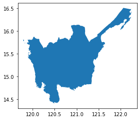

# Geowrangler
> Tools for dealing with geospatial data


## Usage

### Installation

```
pip install git+https://github.com/thinkingmachines/geowrangler.git
```

### Usage

Import packages

```python
import geopandas as gpd

from geowrangler import grids
```

Load a sample geojson file

```python
gdf = gpd.read_file("../data/region3_admin.geojson")
```

    length of gdf: 1 row(s)


```python
print(gdf)
```

        Reg_Code    Reg_Name   Reg_Alt_Name  \
    0  030000000  Region III  Central Luzon   
    
                                                geometry  
    0  MULTIPOLYGON (((120.11687 14.76309, 120.11684 ...  


```python
gdf.plot();
```


    

    


Create a grid generator with a size of 5000

```python
grid_generator = grids.GridGenerator(gdf, 5000)
```

Generate square grids

```python
%%time
grids_gdf = grid_generator.generate_grids()
```

    CPU times: user 27.4 s, sys: 0 ns, total: 27.4 s
    Wall time: 27.4 s


Show gridded version of sample geojson file 

    length of grids_gdf: 1074 row(s)


```python
grids_gdf.plot();
```


    

    


```python
%%time
# write geojson with grids
grids_gdf.to_file("../data/region3_admin_grids.geojson", drivers="GeoJSON")
```

    CPU times: user 242 ms, sys: 103 µs, total: 242 ms
    Wall time: 241 ms


## Development

Please read [CONTRIBUTING.md](https://github.com/thinkingmachines/geowrangler/blob/master/CONTRIBUTING.md) and [CODE_OF_CONDUCT.md](https://github.com/thinkingmachines/geowrangler/blob/master/CODE_OF_CONDUCT.md) before anything

### Setting up

Please ensure you are using python `3.9` or higher

```
pip install pre-commit poetry
pre-commit install
poetry install
poetry run pip install pip --upgrade
poetry run pip install -e .
```
### Jupyter Notebook Development

The code for the **geowrangler** python package resides in Jupyter notebooks located in the `notebooks` folder.

Using [nbdev](https://nbdev.fast.ai), we generate the python package code residing in the `geowrangler` folder from code cells in jupyter notebooks marked with a `#export` comment. A `#default_exp <module_name>` comment at the first code cell of each notebook directs nbdev to put the code in a module named `<module_name>` in the `geowrangler` folder. 

See the [nbdev cli](https://nbdev.fast.ai/cli.html) documentation for more details on the commands to generate the package as well as the documentation.

### Running tests

We are using `pytest` as our test framework. To run all tests and generate a generate a coverage report, run the following.

```
poetry run pytest --cov . -n auto
```

    /home/butchtm/work/ai4d/geowrangler
    ============================= test session starts ==============================
    platform linux -- Python 3.9.12, pytest-7.1.1, pluggy-1.0.0
    rootdir: /home/butchtm/work/ai4d
    plugins: forked-1.4.0, cov-3.0.0, xdist-2.5.0, anyio-3.5.0
    gw0 [2] / gw1 [2] / gw2 [2] / gw3 [2][1mm
    ..                                                                       [100%]
    
    ---------- coverage: platform linux, python 3.9.12-final-0 -----------
    Name                      Stmts   Miss  Cover
    ---------------------------------------------
    geowrangler/__init__.py       1      0   100%
    geowrangler/grids.py         29     14    52%
    tests/test_grids.py          10      1    90%
    tests/test_sample.py          2      0   100%
    ---------------------------------------------
    TOTAL                        42     15    64%
    
    ============================== 2 passed in 2.03s ===============================
    /home/butchtm/work/ai4d/geowrangler/notebooks


To run a single test or test file

```shell
# for a single test function
poetry run pytest tests/test_grids.py::test_create_grids
# for a single test file
poetry run pytest tests/test_grids.py
```

    /home/butchtm/work/ai4d/geowrangler
    ============================= test session starts ==============================
    platform linux -- Python 3.9.12, pytest-7.1.1, pluggy-1.0.0
    rootdir: /home/butchtm/work/ai4d/geowrangler
    plugins: forked-1.4.0, cov-3.0.0, xdist-2.5.0, anyio-3.5.0
    collected 1 item                                                               
    
    tests/test_grids.py .                                                    [100%]
    
    ============================== 1 passed in 0.40s ===============================
    ============================= test session starts ==============================
    platform linux -- Python 3.9.12, pytest-7.1.1, pluggy-1.0.0
    rootdir: /home/butchtm/work/ai4d/geowrangler
    plugins: forked-1.4.0, cov-3.0.0, xdist-2.5.0, anyio-3.5.0
    collected 1 item                                                               
    
    tests/test_grids.py .                                                    [100%]
    
    ============================== 1 passed in 0.39s ===============================

